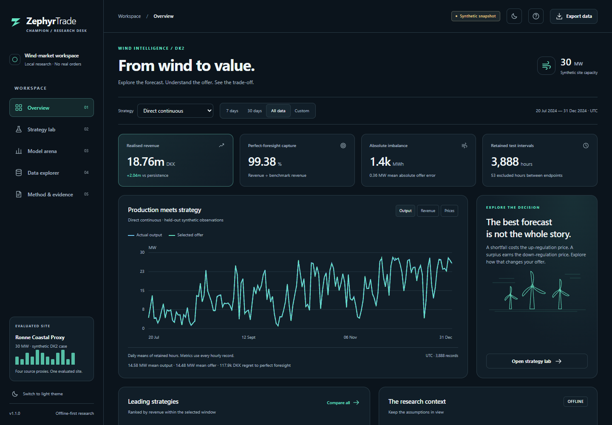
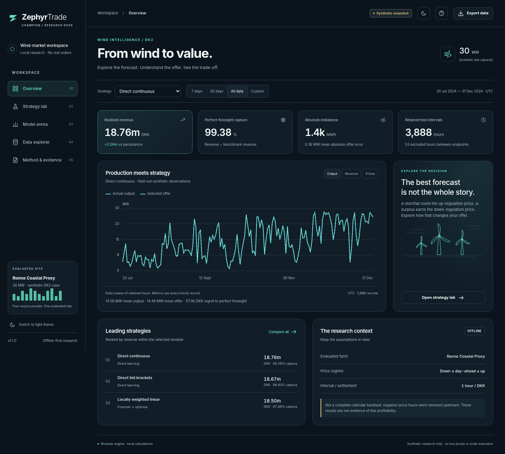

# ZephyrTrade

Research application that generates synthetic wind/weather/price tables, compares wind-forecast and direct-offer strategies, backtests revenue and explores hypothetical offers without placing trades.

If ZephyrTrade helps you study this workflow, a star helps other wind-market and numerical-method researchers find it.



## Try the demo

Prerequisite: Node.js 22 or later; tested here with Node.js 24. This runs locally with synthetic examples. It does not connect to a live provider or publish user input.

```sh
git clone https://github.com/mohammadrezwankhan/zephyrtrade.git
cd zephyrtrade
node scripts/preview-demo.mjs
```

Open **http://127.0.0.1:4173**. Stop the server with Ctrl+C. The first screen is a demonstration, not verified current information. Keep private or real-world records out of this evaluation.

## Why inspect this project?

It gives wind-market and numerical-method researchers a working example of a domain workflow with visible evidence and limitations. Start with the rendered demo, then follow the implementation map in [PROJECT_ANALYSIS.md](PROJECT_ANALYSIS.md). The supplied engineering guide below explains the actual product rules and tradeoffs.

- [Current verification and limits](QUALITY_REPORT.md)
- [Architecture and source map](docs/architecture/system-overview.md)
- [Contribution guide](CONTRIBUTING.md) and [small contribution tasks](docs/CHAMPION_QUESTS.md)
- [Security reporting](SECURITY.md), [support](SUPPORT.md), and [roadmap](ROADMAP.md)

## Develop and verify

Install the Python project with its development extras in an isolated environment; follow the original guide below. HelioForge also has a separately locked web workspace.

```sh
python -m pytest
python -m ruff check src tests
node --test tests/browser/engine.test.cjs
python scripts/verify_engines.py
python -m build
```

Prior reports under `docs/` describe the supplied candidate. They do not replace the current [quality report](QUALITY_REPORT.md). Passing software checks is not clinical, educational, financial, safety, or production-service validation.

## License and scope

First-party source is available under [MIT](LICENSE). Bundled dependencies retain their upstream notices; trademarks and third-party content are not relicensed.

<details>
<summary>Supplied engineering guide, product boundaries, and detailed usage</summary>

# ZephyrTrade Champion
### A local wind-market research desk • candidate 1.1.0

Explore the supplied synthetic backtest, compare nine strategies and calculate
scenario-based offers. There are **no live prices, real orders, broker connections,
accounts, external analytics, remote fonts or CDNs** in this app.



## Start with the portable app — no installation

Extract the ZIP, then open **`ZephyrTrade-Champion.html`** in a current desktop
browser. Windows also has `OPEN_CHAMPION_WINDOWS.bat`. The single HTML contains the
interface, calculations and validated observation snapshot; keep it in a stable
folder. JavaScript must be enabled. Do not open the separate source `web/index.html`
in isolation: use the complete portable HTML or the Python launcher.

Use **Overview** for strategy/date filters and output, cumulative-revenue and price
charts. **Strategy lab** calculates an offer from editable assumptions, saves named
scenarios and exports/imports JSON. **Model arena** compares all nine strategies.
**Data explorer** exposes retained hourly observations and CSV exports. **Method &
evidence** explains the data provenance, exclusions, units and limits.

Saved scenarios use browser-local storage, not a cloud account. Private mode,
enterprise policy, file relocation or clearing browser data can affect persistence.
Export scenario JSON backups. An unavailable save is reported as an error. Draft
inputs are retained while moving between app pages, but are not automatically
written to disk and can be lost on closing/reloading the page. Recalculate edited
inputs before saving or exporting a result.

## Optional: use the real Python / SciPy cross-check

The portable app already calculates an optimal weighted-quantile offer in JavaScript.
The Python service adds a separate SciPy linear-program cross-check on your machine.
It does **not** train a new model when filters change.

On Windows, run `START_PYTHON_WINDOWS.bat`. It requires Python 3.11+ and creates a
new `.venv-champion` environment; first setup needs internet package access. The
launcher does not modify or reuse the uploaded `.venv`. Windows launcher execution
was not available in the Linux verification environment.

On macOS/Linux, run `sh start-python.sh`, or install manually:

```sh
python3 -m venv .venv-champion
. .venv-champion/bin/activate
python -m pip install -e .
python -m zephyrtrade.app
```

Manual Windows activation uses `.venv-champion\Scripts\activate.bat` in Command
Prompt. After startup, open `http://127.0.0.1:8765`. The app opens a browser where the
operating system supports that operation. Keep the terminal open; use Ctrl+C to stop.
A busy port can be avoided with `python -m zephyrtrade.app --port 8766`.
`--no-browser` starts the server without requesting a browser window.

**Do not expose this server to the internet or put it behind a public tunnel.** It
is a local, single-user research server, not a production hosting architecture.
No authentication system is provided because no shared or public service is in scope.

## What is preserved, and what is new?

The original NumPy/pandas/scikit-learn/SciPy research pipeline, synthetic data,
chronological splits and supplied model outputs remain. The original README is
retained, unchanged, as [README_RESEARCH.md](README_RESEARCH.md). Historical reports
under `docs/` describe the uploaded research run, not the new verification run.

New: the browser app, loopback API, scenario validation, recoverable UI states,
source-backed snapshot compiler, launchers and tests. Focused Python repairs address
undefined revenue capture, single-row R², nonfinite inputs, invalid probabilities,
class IDs and a quantile-rounding boundary error. See
[the audit and verification report](docs/champion/AUDIT_AND_RELEASE.md).

One explicit API contract change: `revenue_capture_pct` is `None` when the benchmark
is not positive, and single-observation `r2` is `None`. Callers must handle undefined
metrics rather than treating them as zero. Ordinary positive-benchmark calculations
and valid multi-row metrics are preserved.

## Data boundary

The interface contains **3,888 retained hourly test observations**, **nine strategies**,
one **30 MW synthetic Ronne Coastal Proxy** site and two source-file SHA-256 hashes.
The test snapshot spans 20 July–31 December 2024 UTC; it is **not current market data**.
There are 53 absent hours between endpoints. The original pipeline removed 319
negative-price hours across its full generated source period. It is not an
unfiltered calendar backtest. The sandbox allows negative prices under the stated
price-order assumptions, but that does not restore omitted backtest observations.

Perfect foresight knows actual production and is an analytical benchmark, not an
operational forecast. Forecast issuance, gate-closure availability, current market
rules, transaction costs and real settlement data are not validated. Synthetic
capture percentages do not establish investable or live trading performance.

## Verification and known limits

- 86 Python tests pass with warnings treated as errors, including real local HTTP requests.
- 13 JavaScript numerical test cases pass; 120 seeded scenarios agree with SciPy to less than 0.000001 DKK in objective value.
- 23 Chromium UI-harness checks pass across 320–1440 CSS-pixel layouts. Screenshots are of the implemented app.
- All 34,992 saved strategy revenue values reconcile with recomputation; largest difference is approximately 3.64e-12 DKK.

**The test browser's administrator policy blocked direct file and localhost navigation.**
UI checks therefore render the shipped HTML with Playwright `set_content` and use an
explicit in-memory Storage double. Native durable browser storage, direct file opening
and browser-to-Python integration still need a normal-browser check. Python HTTP and
browser calculations were tested separately; this is not a claim of full hosted E2E.

A new bounded training smoke completed using the normal Phase 2 and a reduced Phase 3
grid. Four Lasso convergence warnings are retained in its log. The default full-grid
pipeline exceeded the 120-second test limit and is not verified end to end here.
The supplied multi-year models were **not retrained or replaced**.

Ruff and the `build` frontend could not be installed in this environment. Do not read
this delivery as a passing hosted CI, complete WCAG conformance, security certification,
human UAT sign-off or production release. Detailed status and evidence are in
`docs/champion/`. This is a **local research release candidate**, not a deployed product.

## Reproduce the checks

Install `.[dev]` in a development environment with package access. Node is only needed
for JavaScript tests and parity verification, not to use the app.

```sh
python -m pytest -W error
node --test tests/browser/engine.test.cjs
python scripts/verify_engines.py
python scripts/build_app.py
python -m ruff check src tests
python -m ruff format --check src tests
python -m build
```

The optional browser harness requires Playwright and Chromium:
`python scripts/check_browser.py --chromium /path/to/chromium`.
It documents its Storage test double and navigation limitations in its output.
For a bounded fresh training check, choose a new directory:
`python scripts/smoke_research.py --output /tmp/zephyr-new-smoke`.

To reproduce the original full research workflow, follow `README_RESEARCH.md`; it is
computationally heavier than browsing the packaged snapshot. Use new output directories
rather than overwriting the supplied evidence. `requirements-tested.txt` records observed
scientific-package versions; it is not a cross-platform resolved lockfile.

## Licence and distribution

The supplied project has an MIT licence, retained in `LICENSE`. New app icons, CSS,
SVG diagrams and interface code are original and use that project licence. No font
files, model-environment executables or third-party frontend bundles are included.
The root ZIP includes the original datasets and reports. The wheel is a Python app
package with its precompiled web snapshot, not a standalone Windows executable.


</details>
