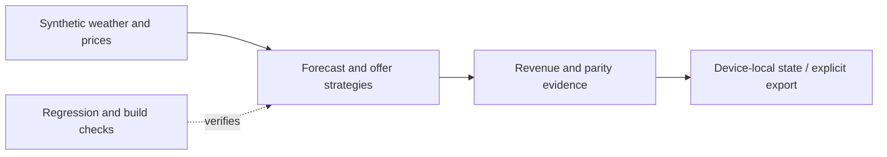

# ZephyrTrade: data and rule boundaries

ZephyrTrade generates synthetic wind, weather and price tables, compares forecast and direct-offer strategies, and reconciles hypothetical revenue. Its Python and browser engines expose the assumptions so a researcher can inspect numerical agreement instead of relying on a dashboard alone.

- `src/zephyrtrade/app.py`
- `src/zephyrtrade/optimize.py`
- `src/zephyrtrade/web/engine.js`
- `scripts/verify_engines.py`
- `tests/test_app.py`
- `artifacts/reproduction/results/run_manifest.json`

This depicts the delivered local workflow. See the engineering case study for the test boundary; it does not assert a hosted production service or external delivery.
