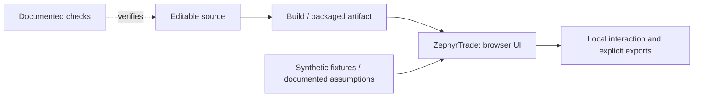

# ZephyrTrade: architecture

Research application that generates synthetic wind/weather/price tables, compares wind-forecast and direct-offer strategies, backtests revenue and explores hypothetical offers without placing trades.

The diagram covers the delivered demonstration path. It does not imply a production backend or source verification service. The source map below identifies the actual modules; consult their tests before changing a domain rule.

- `src/zephyrtrade/app.py`
- `src/zephyrtrade/optimize.py`
- `src/zephyrtrade/web/engine.js`
- `scripts/verify_engines.py`
- `tests/test_app.py`
- `artifacts/reproduction/results/run_manifest.json`

The Python service supplies an independent numerical cross-check; the portable app also runs a browser calculation. Neither places a trade.
