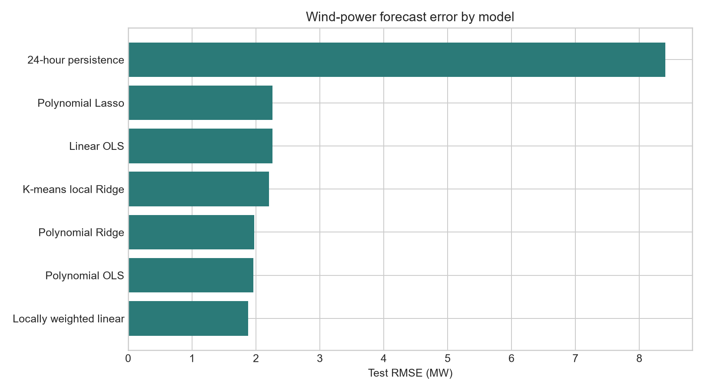
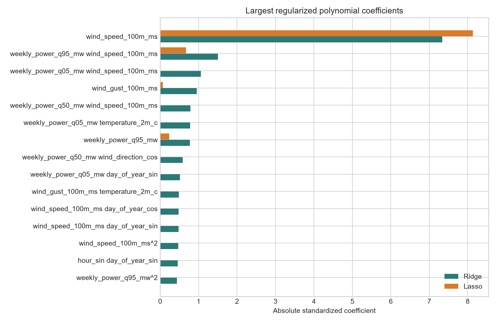
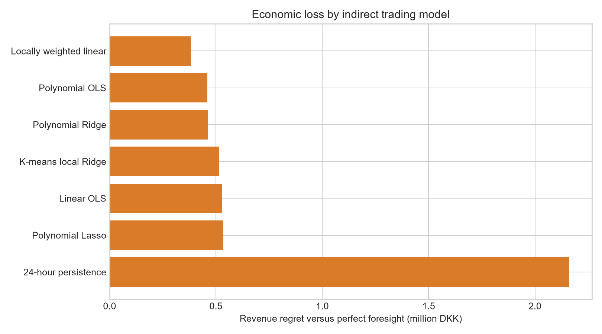
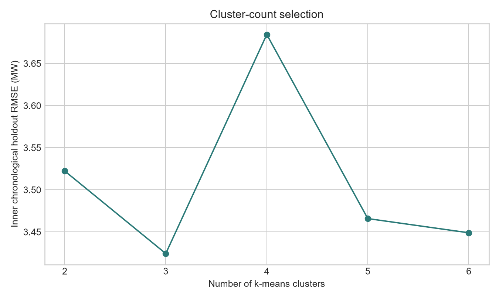
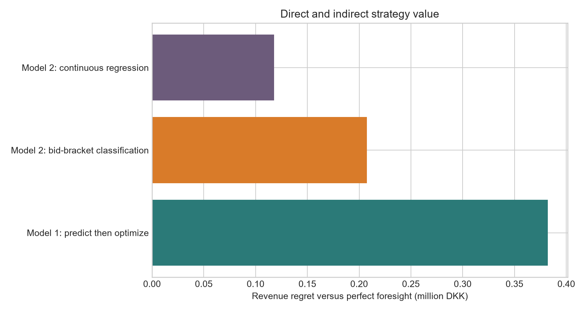
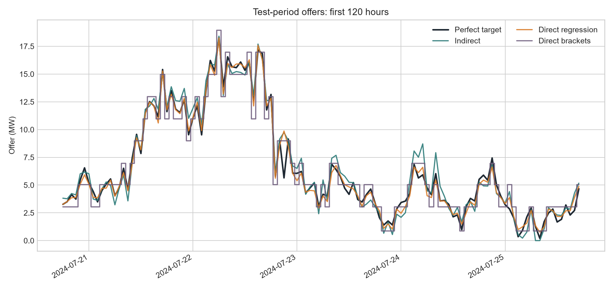
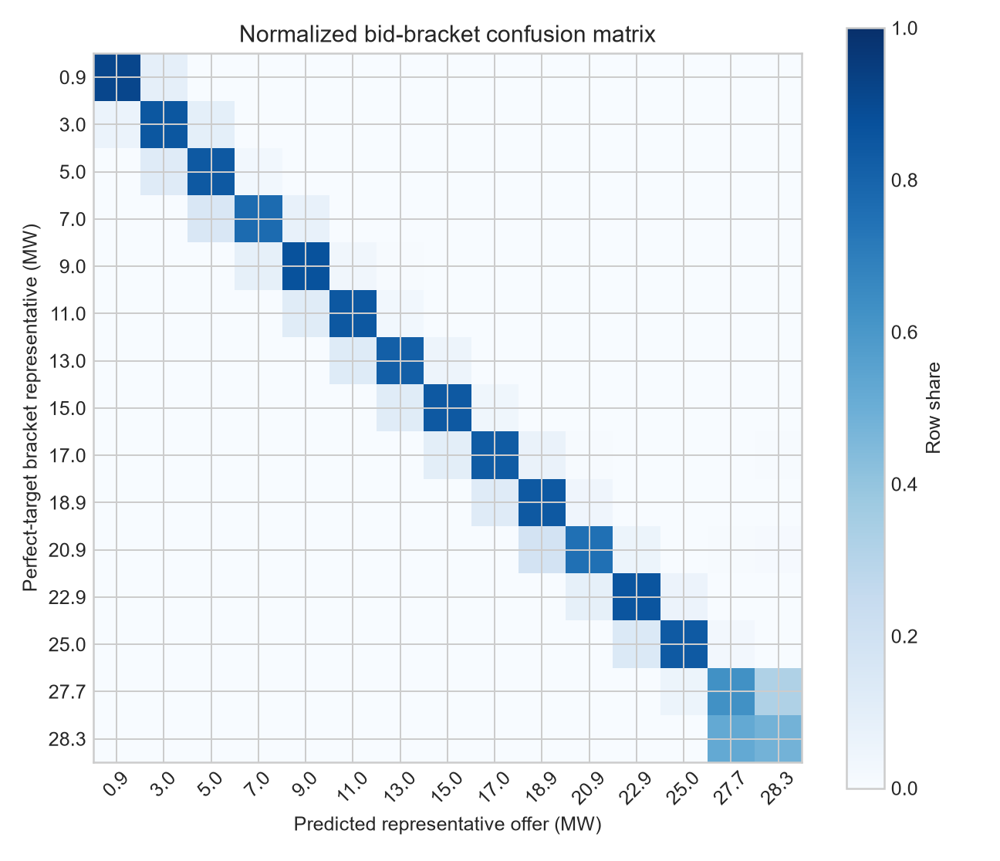
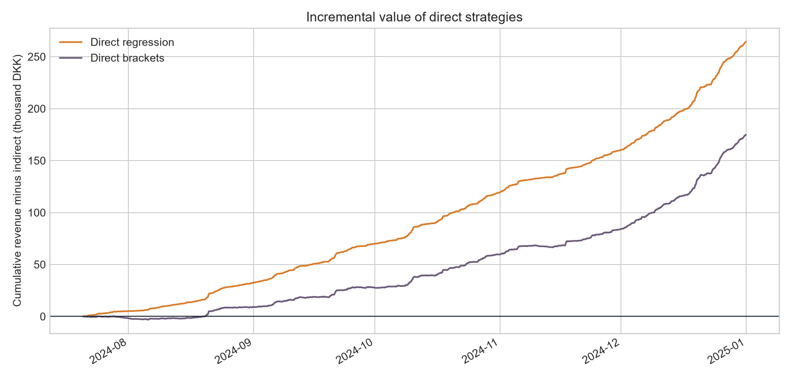
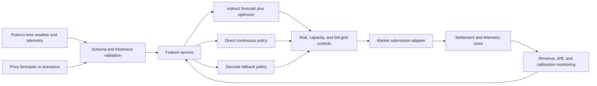

# ZephyrTrade: ML-Driven Wind Energy Market Optimizer

## Final academic report

**Market area:** Bornholm, DK2  
**Study design:** indirect forecast-then-optimize trading versus direct strategy
learning  
**Current status:** complete reproducible study

## Abstract

This study develops two machine-learning approaches for offering wind energy in
the day-ahead and balancing markets. Model 1 predicts wind production and passes
the prediction to a mathematical trading model. Model 2 learns an offering
decision directly from information available at bid time. The experiments are
designed for a selected synthetic wind-farm proxy on Bornholm in the DK2 bidding
zone, while the source layer retains four correlated farm proxies. Phase 1
establishes a deterministic, physically informed data generator and a
point-in-time-correct preprocessing pipeline. It excludes intervals containing
negative prices as required by the project specification, builds previous-day
and trailing-week power features, encodes climate and calendar variables, and
uses a strict chronological 70/15/15 train-validation-test allocation. Scaling
statistics are estimated on training observations only. Phase 2 formulates the
trading decision as a stochastic linear program and compares linear,
polynomial, locally weighted, regularized, and clustered regression models on
3,888 untouched test hours. Locally weighted linear regression achieves the
best wind-power test RMSE at 1.876 MW and realized revenue of DKK 18.497
million, or 97.98% of perfect-foresight revenue. Phase 3 derives the direct
target from the deterministic perfect-foresight LP and compares continuous
gradient-boosted regression with probabilistic bid-bracket classification.
Continuous direct regression is best: it earns DKK 18.761 million, captures
99.38% of perfect-foresight revenue, and exceeds the leading indirect strategy
by approximately DKK 264,230 over the test interval. The direct result must be
interpreted with care because the perfect-foresight LP label collapses to actual
production under the maintained price ordering, and the direct learner is more
flexible than the Phase 2 indirect benchmark.

**Keywords:** wind power forecasting; electricity-market bidding; stochastic
optimization; predict-then-optimize; prescriptive machine learning; Bornholm;
DK2

## 1. Research scope and experimental design

The commercial problem is to select an hourly day-ahead offer for uncertain wind
production. Deviations between the contracted offer and realized generation are
settled in the balancing market. Forecast error therefore has an asymmetric and
time-varying economic effect: the same absolute power error can have materially
different value under different day-ahead, upward-regulation, and
downward-regulation prices. This motivates evaluation by realized revenue in
addition to conventional forecast metrics.

The repository compares two workflows. Model 1 uses regression to estimate wind
power, after which a constrained optimization model determines the offer. Model
2 uses supervised learning to approximate the perfect-foresight offer directly.
The separation makes it possible to test whether prediction accuracy is a useful
surrogate for the actual decision objective.

The selected modeling asset is `bornholm_ronne_coastal`, a 30 MW synthetic site
proxy. Three additional proxies are retained in the source layer to represent
spatially correlated Bornholm production and to enable later robustness studies.
The site names, coordinates, capacities, observations, and market values are
synthetic; they are not presented as measurements from commercial wind farms.

### 1.1 Research context and contribution

The study sits at the intersection of probabilistic renewable-energy trading
and decision-focused machine learning. In wind trading, a point forecast is not
generally the value-maximizing bid because the settlement cost of overproduction
differs from that of underproduction. Zugno, Jónsson, and Pinson showed that a
price-taking wind producer's optimal offer can be expressed as a quantile of the
conditional wind distribution and demonstrated the idea in the DK2 area. Their
analysis motivates the critical-fractile LP used here. More broadly, Bertsimas
and Kallus formalized the move from predictive accuracy to prescriptions based
on auxiliary observations, while Elmachtoub and Grigas showed how downstream
optimization structure can define a decision-aware loss rather than treating
prediction and optimization as unrelated stages.

ZephyrTrade makes four practical contributions within that context. First, it
provides a complete source-to-decision research implementation rather than an
isolated notebook: data validation, leakage-safe history, model training,
optimization, backtesting, tests, and manifests use explicit contracts. Second,
it compares linear, polynomial, local, regularized, and clustered prediction
models under both statistical and financial criteria. Third, it constructs and
tests continuous and discrete direct policies on exactly the same test hours as
the indirect models. Fourth, it exposes a structural limitation of the direct
target: when perfect foresight supplies one production scenario under the
maintained two-price order, the optimal bid equals production. Reporting that
degeneracy prevents a nominally direct model from being misrepresented as a
richer prescriptive target than it actually is.

The contribution is therefore methodological and reproducible rather than a
claim of deployable alpha. The synthetic baseline supports controlled
comparisons; it does not establish that the reported DKK gains would survive
real forecast vintages, price uncertainty, transaction costs, or revised
settlement rules.

## 2. Data sources and reproducible synthetic baseline

The fully reproducible baseline uses source-aligned synthetic data. This choice
avoids credentials, provider outages, revisions to historical APIs, and any
false claim that public aggregate data describe an individual asset. The schema
is compatible with public substitutions from Energinet's Energi Data Service,
the ENTSO-E Transparency Platform, and Open-Meteo historical reanalysis.
Energinet's historical `Elspotprices` series is relevant to earlier hourly
periods but is now discontinued for new observations; current replacement and
imbalance datasets must be checked at extraction time. A real-data extension
must therefore pin the market regime, resolution, retrieval time, and provider
metadata rather than assuming that a dataset name describes a stable contract.

The generator creates hourly timestamps in `Europe/Copenhagen` and stores them
in UTC. This preserves an unambiguous sequence across daylight-saving changes.
Four farm-level climate series share a regional weather process and contain
site-specific perturbations. The normalized physical production response is
approximated by a generic cubic power curve:

$$
g(v_t) =
\begin{cases}
0, & v_t < v_{\mathrm{in}}, \\
\dfrac{v_t^3-v_{\mathrm{in}}^3}
{v_{\mathrm{rated}}^3-v_{\mathrm{in}}^3},
& v_{\mathrm{in}} \leq v_t < v_{\mathrm{rated}}, \\
1, & v_{\mathrm{rated}} \leq v_t \leq v_{\mathrm{out}}, \\
0, & v_t > v_{\mathrm{out}}.
\end{cases}
$$

The synthetic settings use
$v_{\mathrm{in}}=3\ \mathrm{m/s}$,
$v_{\mathrm{rated}}=12\ \mathrm{m/s}$, and
$v_{\mathrm{out}}=25\ \mathrm{m/s}$. Farm output combines this response with
nameplate capacity, site wake efficiency, stochastic derating, and bounded
measurement noise. The resulting target satisfies
$0 \leq P_t \leq P^{\max}$.

Day-ahead prices combine a seasonal component, morning and evening load peaks,
cold-weather demand, wind-price cannibalization, persistent innovations, and
rare spikes. Upward-regulation prices carry a premium when wind falls, whereas
downward-regulation prices are discounted when wind rises. Negative-price
events are generated deliberately and then removed. For price vector
$\boldsymbol{\pi}_t =
(\pi_t^{\mathrm{DA}},\pi_t^{\uparrow},\pi_t^{\downarrow})$,
an interval is retained only when

$$
\min \left(\boldsymbol{\pi}_t\right) \geq 0.
$$

The provenance manifest records the seed, date interval, public reference URLs,
row counts, and number and share of excluded price intervals. Production and
weather remain available for every physical hour before the market join. This
is important because a negative price at time $t-24$ should not erase the
historical power observation needed to construct the lag at time $t$.

## 3. Feature engineering for Model 1

The prediction target is selected-farm actual power $P_t$ in MW. Every feature
is either known before the target interval or is treated as a point-in-time
weather forecast proxy. Realized market prices are retained only for later
revenue calculation and are not included in the Model 1 wind-feature matrix.

The core historical feature is the exact previous-day observation
$P_{t-24}$. Weekly distributional summaries use observations strictly before
the target:

$$
q_{\alpha,t}^{(168)} =
\operatorname{Quantile}_{\alpha}
\left(\{P_{t-168},\ldots,P_{t-1}\}\right),
\qquad
\alpha \in \{0.05,0.50,0.95\}.
$$

The implementation shifts the power series before applying the rolling window,
so $P_t$ cannot enter its own predictor. A minimum of 72 prior observations is
required, while complete rows become available after the 24-hour lag and
weekly-history constraints are satisfied.

| Feature group | Variables | Rationale |
|---|---|---|
| Historical power | $P_{t-24}$; weekly 0.05, 0.50, and 0.95 quantiles | Captures daily persistence, central tendency, and recent production spread |
| Wind | 100 m speed, gust, sine and cosine of direction | Represents turbine forcing while avoiding the 0/360-degree discontinuity |
| Climate | 2 m temperature, surface pressure, relative humidity | Describes air-mass and weather-regime variation |
| Calendar | sine and cosine of local hour and day of year | Encodes periodicity without artificial end-point jumps |

Direction and calendar variables are encoded as paired cyclic coordinates. For
an angular variable $a$ with period $T$, the mapping is

$$
a \mapsto
\left(
\sin\left(\frac{2\pi a}{T}\right),
\cos\left(\frac{2\pi a}{T}\right)
\right).
$$

This preserves proximity between observations on opposite sides of the numeric
boundary, such as 23:00 and 00:00.

## 4. Scaling methodology

Features have heterogeneous units and magnitudes. Wind speed is measured in
meters per second, power in MW, pressure in hPa, humidity in percent, and cyclic
coordinates are dimensionless. Every feature is therefore standardized using a
training-only mean and standard deviation:

$$
z_{t,j} = \frac{x_{t,j}-\mu_j^{\mathrm{train}}}
{\sigma_j^{\mathrm{train}}}.
$$

The fitted transformation is applied unchanged to validation and test rows.
This is essential for Ridge and Lasso because their penalties act directly on
coefficient magnitude. It also prevents information from future distributions
from affecting the training representation. The fitted `StandardScaler`, its
means and scales, the ordered feature list, and human-readable definitions are
persisted with the processed data.

The target remains in MW. Retaining the original target scale makes RMSE and MAE
operationally interpretable and supports direct capacity clipping in later
phases. The raw feature table is also saved, allowing coefficient and data
audits without reversing a transformation.

## 5. Training, validation, and testing design

Random splitting is inappropriate for serially correlated energy data because
nearby observations share weather regimes and lagged power. The cleaned feature
matrix is sorted by UTC timestamp and partitioned without shuffling:

$$
\mathcal{D}
=
\mathcal{D}_{\mathrm{train}}
\cup
\mathcal{D}_{\mathrm{validation}}
\cup
\mathcal{D}_{\mathrm{test}},
$$

with 70%, 15%, and 15% of ordered rows respectively. The ordering constraint is

$$
\max t_{\mathrm{train}}
<
\min t_{\mathrm{validation}}
\leq
\max t_{\mathrm{validation}}
<
\min t_{\mathrm{test}}.
$$

The training interval estimates coefficients. The validation interval selects
polynomial degree, local-weight bandwidth, regularization strength, and cluster
count in Phase 2. The test interval remains untouched until the final forecast
and revenue comparison. This three-way allocation prevents repeated
hyperparameter decisions from adapting to the reported test result.

Each split retains the UTC timestamp, farm identifier, unscaled target,
capacity, market area, and three market-price columns. These metadata do not
enter the wind predictor but enable the downstream optimizer to reconstruct
realized hourly cash flow on exactly the same observations.

## 6. Phase 1 quality controls and limitations

Automated checks enforce four-farm coverage, unique timestamp keys, no missing
source values, physical production bounds, valid humidity, nonnegative retained
prices, deterministic generation, exact lag behavior, rolling-window exclusion
of the current target, chronological split boundaries, and near-zero training
feature means after scaling. The command-line modules fail with descriptive
errors if source tables are missing, a farm identifier is unknown, the physical
wind history has gaps, or the split allocation is infeasible.

The synthetic baseline is a controlled methodological test bed rather than an
empirical claim about historical DK2 profitability. It omits turbine-specific
power curves, planned outages, curtailment labels, forecast vintage, gate
closure, bid granularity, transaction costs, market fees, and changes in Danish
imbalance settlement. Filtering negative prices also changes the economic sample
and can make revenue appear less exposed to adverse regimes. These limitations
are preserved throughout the interpretation so demonstration results remain
distinct from production recommendations.

## 7. Day-ahead and balancing-market linear program

Let $\mathcal{T}$ denote delivery hours and $\mathcal{S}_t$ the finite set of
wind-production scenarios for hour $t$. The scenario probability is $p_{t,s}$,
with $p_{t,s}\geq 0$ and $\sum_{s\in\mathcal{S}_t}p_{t,s}=1$. The parameters
$\lambda_t^{\mathrm{DA}}$, $\lambda_t^{\uparrow}$, and
$\lambda_t^{\downarrow}$ are respectively the day-ahead, upward-regulation, and
downward-regulation prices in DKK/MWh. Scenario production is $P_{t,s}$ and
installed capacity is $P^{\max}$.

The first-stage decision $q_t$ is the nonnegative day-ahead offer in MW. The
scenario recourse variables $e_{t,s}$ and $d_{t,s}$ are respectively surplus
production sold at the down-regulation price and shortfall purchased at the
up-regulation price. The stochastic offering problem is the following exact
linear program:

$$
\max_{q,e,d}
\quad
\sum_{t\in\mathcal{T}}
\sum_{s\in\mathcal{S}_t}
p_{t,s}
\left(
\lambda_t^{\mathrm{DA}}q_t
+\lambda_t^{\downarrow}e_{t,s}
-\lambda_t^{\uparrow}d_{t,s}
\right)
$$

subject to

$$
q_t+e_{t,s}-d_{t,s}=P_{t,s},
\qquad
\forall t\in\mathcal{T},\ s\in\mathcal{S}_t,
$$

$$
0\leq q_t\leq P^{\max},
\qquad
\forall t\in\mathcal{T},
$$

$$
e_{t,s}\geq 0,
\qquad
d_{t,s}\geq 0,
\qquad
\forall t\in\mathcal{T},\ s\in\mathcal{S}_t.
$$

The balance equation implies
$e_{t,s}=\max(P_{t,s}-q_t,0)$ and
$d_{t,s}=\max(q_t-P_{t,s},0)$ at an optimum when the no-arbitrage ordering

$$
\lambda_t^{\downarrow}
\leq
\lambda_t^{\mathrm{DA}}
\leq
\lambda_t^{\uparrow}
$$

holds. The implementation validates this ordering and provides an explicit
SciPy `linprog` solver. Because there are no intertemporal constraints, the LP
decomposes by hour. Its exact vectorized solution is the production-distribution
quantile at the critical fractile

$$
\tau_t=
\frac{
\lambda_t^{\mathrm{DA}}-\lambda_t^{\downarrow}
}{
\lambda_t^{\uparrow}-\lambda_t^{\downarrow}
}.
$$

For each predictive model, validation residuals
$\varepsilon_i=P_i-\widehat{P}_i$ form equiprobable error scenarios around the
test point prediction. The offer is therefore

$$
q_t^{*}
=
\operatorname{clip}
\left(
\widehat{P}_t
+Q_{\tau_t}(\varepsilon),
0,
P^{\max}
\right),
$$

where $Q_{\tau_t}$ is the empirical inverse cumulative distribution. Unit tests
verify that this quantile rule attains the same expected objective value as the
explicit LP. Realized test revenue is calculated as

$$
R_t
=
\lambda_t^{\mathrm{DA}}q_t
+\lambda_t^{\downarrow}\max(P_t-q_t,0)
-\lambda_t^{\uparrow}\max(q_t-P_t,0).
$$

The Phase 2 experiment supplies historical realized prices to the optimizer.
This controlled ex-post design isolates the economic effect of wind-model error,
but it is an upper bound on deployable performance because balancing prices are
not known at day-ahead gate closure.

## 8. Linear regression: gradient descent and closed form

For design matrix $X$ and power vector $y$, ordinary least squares solves

$$
\min_{\beta}
\quad
\frac{1}{2n}\lVert X\beta-y\rVert_2^2.
$$

For full-column-rank $X$, the classical closed form and its Moore-Penrose
extension are

$$
\widehat{\beta}_{\mathrm{OLS}}
=
\left(X^{\mathsf{T}}X\right)^{-1}X^{\mathsf{T}}y
=
X^{\dagger}y.
$$

The implementation evaluates this solution with a stable least-squares
factorization rather than explicitly forming the inverse, while batch gradient
descent applies

$$
\beta^{(k+1)}
=
\beta^{(k)}
-\eta
\frac{1}{n}X^{\mathsf{T}}
\left(X\beta^{(k)}-y\right).
$$

The step size is $\eta=1/L$, where $L$ is the largest eigenvalue of
$X^{\mathsf{T}}X/n$. The comparison uses 100 observations spaced evenly across
the training interval and all 15 features. Gradient descent converged after
20,191 iterations. The maximum prediction difference from closed-form OLS was
$5.34\times10^{-10}$ MW; the maximum coefficient difference was
$2.01\times10^{-9}$ and the objectives agreed to machine precision. The two
methods therefore produce the same empirical solution, after which the scalable
closed-form estimator is used on all 18,139 training observations.

Global linear OLS produces a test RMSE of 2.257 MW, MAE of 1.759 MW, and
$R^2=0.934$. This is a large improvement over 24-hour persistence but leaves
systematic power-curve nonlinearity for the next model family.

## 9. Nonlinear and locally weighted regression

Second-degree polynomial regression maps the 15 standardized inputs to 135
linear, squared, and pairwise-interaction terms. If $\phi_2(x_t)$ denotes this
map, the fitted response is

$$
\widehat{P}_t
=
\beta_0+\phi_2(x_t)^{\mathsf{T}}\beta.
$$

Polynomial OLS lowers test RMSE to 1.960 MW and increases $R^2$ to 0.951. This
confirms that a global linear relationship is too restrictive for the cubic
turbine response embedded in the data generator.

The locally weighted estimator implements the method illustrated in the
supplied weighted-least-squares notebook. At query $x_0$, it selects the 192
nearest training observations and estimates a centered local plane:

$$
\min_{\beta_0,\beta}
\quad
\sum_{i\in\mathcal{N}(x_0)}
K\left(\frac{\lVert x_i-x_0\rVert_2}{h_{x_0}}\right)
\left[
y_i-\beta_0-\beta^{\mathsf{T}}(x_i-x_0)
\right]^2
+10^{-5}\lVert\beta\rVert_2^2,
$$

where $h_{x_0}$ is the farthest-neighbor distance and the tricube kernel is

$$
K(u)=
\begin{cases}
(1-u^3)^3, & 0\leq u\leq 1, \\
0, & u>1.
\end{cases}
$$

This model is best overall with RMSE 1.876 MW, MAE 1.221 MW, and
$R^2=0.955$. Its improvement over polynomial OLS indicates that production
response varies locally across weather and operating regimes in ways that one
global quadratic surface does not fully capture.



## 10. L1 and L2 regularization

The 135 polynomial terms make coefficient control important. Ridge and Lasso
solve the generic penalized objectives

$$
\widehat{\beta}_{\mathrm{Ridge}}
=
\arg\min_{\beta}
\left\{
\lVert y-\Phi\beta\rVert_2^2
+\alpha\lVert\beta\rVert_2^2
\right\},
$$

$$
\widehat{\beta}_{\mathrm{Lasso}}
=
\arg\min_{\beta}
\left\{
\frac{1}{2n}\lVert y-\Phi\beta\rVert_2^2
+\alpha\lVert\beta\rVert_1
\right\}.
$$

Every polynomial column is standardized before penalization. Nine logarithmic
values are evaluated with three expanding-window folds contained entirely in
the training interval. These equations follow the respective scikit-learn
objective conventions, so the numerical strengths are not directly comparable.
The selected Ridge value is $\alpha=31.623$; the selected Lasso value is
$\alpha=0.316$.

Ridge retains all 135 terms and records RMSE 1.971 MW, slightly behind
unregularized polynomial OLS. Its largest coefficient is 100 m wind speed,
followed by the interaction between weekly 0.95 power and wind speed. Other
influential terms include weekly 0.05 power by wind speed, wind gust, weekly
median by wind speed, and weekly 0.05 power by temperature.

Lasso sets 130 of 135 coefficients exactly to zero, a sparsity rate of 96.3%.
The five retained terms are 100 m wind speed; weekly 0.95 power by wind speed;
weekly 0.95 power; wind gust; and wind speed by wind-direction cosine. Despite
its interpretability, this aggressive shrinkage raises test RMSE to 2.262 MW.
The training-fold optimum therefore did not transfer as well to the later test
regime. This is evidence against selecting regularization by sparsity alone.



## 11. Forecast and revenue comparison

The following table reports the untouched chronological test interval. Power
predictions are clipped to $[0,P^{\max}]$. Revenue uses validation residuals as
production scenarios and the critical-fractile LP decision.

| Rank | Model | RMSE (MW) | MAE (MW) | $R^2$ |
|---:|---|---:|---:|---:|
| 1 | Locally weighted linear | 1.876 | 1.221 | 0.955 |
| 2 | Polynomial OLS | 1.960 | 1.468 | 0.951 |
| 3 | Polynomial Ridge | 1.971 | 1.475 | 0.950 |
| 4 | K-means local Ridge | 2.203 | 1.655 | 0.938 |
| 5 | Linear OLS | 2.257 | 1.759 | 0.934 |
| 6 | Polynomial Lasso | 2.262 | 1.755 | 0.934 |
| 7 | 24-hour persistence | 8.408 | 6.414 | 0.090 |

Perfect foresight earns DKK 18.879 million by offering realized production and
incurring no imbalance. Revenue ranks match forecast-error ranks in this
synthetic experiment, although this agreement is not guaranteed in general.

| Rank | Model | Revenue (million DKK) | Capture (%) | Regret (million DKK) |
|---:|---|---:|---:|---:|
| 1 | Locally weighted linear | 18.497 | 97.976 | 0.382 |
| 2 | Polynomial OLS | 18.420 | 97.565 | 0.460 |
| 3 | Polynomial Ridge | 18.416 | 97.548 | 0.463 |
| 4 | K-means local Ridge | 18.366 | 97.280 | 0.514 |
| 5 | Linear OLS | 18.349 | 97.192 | 0.530 |
| 6 | Polynomial Lasso | 18.345 | 97.171 | 0.534 |
| 7 | 24-hour persistence | 16.719 | 88.558 | 2.160 |



Locally weighted regression earns approximately DKK 147,922 more than global
linear OLS and reduces perfect-foresight regret by 27.9%. Polynomial OLS and
Ridge are nearly tied economically: regularization sacrifices about DKK 3,144
on the test period relative to polynomial OLS. Lasso's sparse specification
earns DKK 3,906 less than linear OLS, illustrating that coefficient selection
can reduce accuracy and value when the later regime differs from the training
folds.

## 12. K-means clustering enhancement

K-means uses standardized wind speed, wind direction, temperature, pressure,
and cyclic hour features to identify weather regimes. Candidate counts
$k\in\{2,3,4,5,6\}$ are evaluated on the final 20% of the training interval;
validation and test data remain untouched. Three clusters minimize inner
holdout RMSE at 3.424 MW. One Ridge regression is then trained within each
selected cluster using the complete feature vector.



On the final test set, clustered Ridge lowers RMSE from 2.257 MW for global
linear OLS to 2.203 MW, an improvement of 2.4%, and adds approximately DKK
16,588 of revenue. The enhancement is real but modest. It remains DKK 131,333
below locally weighted regression because hard cluster assignments create only
three response surfaces, whereas the tricube model adapts continuously to each
query neighborhood. Clustering therefore helps the linear baseline but does not
supplant the stronger nonlinear method.

## 13. Phase 2 conclusions and transition to direct learning

The principal Phase 2 conclusion is that local nonlinear structure matters more
than global coefficient shrinkage for this synthetic wind farm. Locally weighted
linear regression provides the strongest forecast and economic result, while a
quadratic model offers a faster and still competitive alternative. Ridge is
stable but does not improve the unregularized quadratic model; Lasso is highly
interpretable but overly sparse in the test regime. K-means local models improve
on global linear OLS without reaching the continuous local estimator.

These rankings are conditional on filtered nonnegative prices, synthetic
production, zero transaction costs, and perfect ex-post knowledge of balancing
prices. A deployable trader must replace those prices with point-in-time price
forecasts or joint price-production scenarios and should add risk limits, bid
granularity, and settlement-rule checks.

Phase 3 reconstructs the label as the perfect-foresight optimal offer and
compares direct continuous regression with discrete bid-bracket classification.
The best indirect benchmark carried forward is locally weighted regression with
the empirical-residual LP, evaluated on the same test timestamps and market
settlement function.

## 14. Phase 3 target engineering

The direct label is defined by solving the trading LP with perfect knowledge of
the single realized production outcome. Let $p_t$ be that outcome and $q_t$ the
offer. Its deterministic interval revenue is

$$
R_t(q_t;p_t)
=
\pi_t^{\mathrm{DA}}q_t
+\pi_t^{\downarrow}(p_t-q_t)^+
-\pi_t^{\uparrow}(q_t-p_t)^+.
$$

For an offer below production, the marginal revenue from increasing the offer
is the difference between the day-ahead and down-regulation prices. Above
production, it is the difference between the day-ahead and up-regulation
prices:

$$
\frac{\partial R_t}{\partial q_t}
=
\begin{cases}
\pi_t^{\mathrm{DA}}-\pi_t^{\downarrow} \geq 0,
& q_t<p_t, \\
\pi_t^{\mathrm{DA}}-\pi_t^{\uparrow} \leq 0,
& q_t>p_t.
\end{cases}
$$

Consequently, under
$\pi_t^{\downarrow}\leq\pi_t^{\mathrm{DA}}\leq
\pi_t^{\uparrow}$, a perfect-foresight optimum is

$$
q_t^{\mathrm{PF}}=p_t,
\qquad
0\leq q_t^{\mathrm{PF}}\leq P^{\max}.
$$

The optimum is unique when both inequalities are strict; price equality can
create economically equivalent offers, but $p_t$ remains optimal. This is a
structural degeneracy, not a numerical shortcut. The implementation validates
all price and capacity conditions, constructs the complete label vector from
the analytical LP solution, and compares 25 evenly spaced strict-price training
rows with independent `scipy.optimize.linprog` solves. The maximum difference
is 0 MW. The derived label equals actual power for 100% of training rows.

This result narrows the interpretation of Model 2. The model predicts an offer
and removes the optimization step at inference, but its supervised target is
numerically identical to production in this two-price, single-scenario
perfect-foresight formulation. A richer direct-decision label would require
additional decision structure such as block bids, ramp limits, transaction
costs, multi-interval coupling, risk constraints, or price uncertainty.

## 15. Direct continuous and discrete strategy models

Both direct learners use the same 15 standardized, bid-time features as Model
1. Realized day-ahead and balancing prices are not inference inputs. Historical
prices affect training only through an economic sample weight

$$
w_t
=
\frac{
\pi_t^{\uparrow}-\pi_t^{\downarrow}
}{
\frac{1}{n}\sum_{i=1}^{n}
(\pi_i^{\uparrow}-\pi_i^{\downarrow})
},
$$

so mistakes during costly imbalance regimes receive more influence without
assuming that future realized prices are known when a bid is submitted.

### 15.1 Continuous direct regression

The continuous model is a histogram gradient-boosted tree ensemble
$g_\theta(x_t)$. Squared-error regression and quantile regression at
$\tau\in\{0.20,0.35,0.50,0.65,0.80\}$ are candidates. The weighted quantile
objective is

$$
\widehat{\theta}_{\tau}
=
\arg\min_{\theta}
\sum_{t=1}^{n}
w_t\rho_{\tau}
\left(q_t^{\mathrm{PF}}-g_{\theta}(x_t)\right),
$$

where the pinball loss is

$$
\rho_{\tau}(u)
=
\begin{cases}
\tau u, & u\geq 0, \\
(\tau-1)u, & u<0.
\end{cases}
$$

Candidate maximum leaf counts are 15 and 31. Every model uses a learning rate
of 0.06, 250 boosting iterations, a minimum of 30 observations per leaf, and
L2 tree regularization of 0.1. The final 20% of the chronological training
period is reserved as an inner selection interval. Candidates are ranked by
realized revenue on that interval, with strategy RMSE as a tie-breaker. The
selected specification uses $\tau=0.35$ and 15 maximum leaves, after which it
is refit on the complete training split.

### 15.2 Bid-bracket classification

Classification represents the offer as one of $J$ capacity brackets. For
$J\in\{6,10,15\}$, uniform bracket edges are

$$
b_j=\frac{jP^{\max}}{J},
\qquad
j=0,\ldots,J.
$$

Each perfect-foresight target is assigned to its interval. The decoded offer
for class $j$ is the median training target in that class, with the bracket
midpoint as a fallback for an empty class. A gradient-boosted classifier learns
the conditional class probabilities. Rather than defaulting to the most likely
class, a decision quantile $\kappa$ maps the predictive cumulative distribution
to an economically tunable discrete action:

$$
\widehat{c}_t
=
\min\left\{
j:
\sum_{k=0}^{j}
\widehat{\Pr}(c_t=k\mid x_t)
\geq\kappa
\right\}.
$$

The same chronological selection interval evaluates
$\kappa\in\{0.20,0.35,0.50,0.65,0.80\}$ jointly with bracket and leaf counts.
Fifteen brackets, 31 maximum leaves, and $\kappa=0.20$ maximize inner-holdout
revenue. The low decision quantile produces a modest under-offer bias, which is
economically plausible because upward-regulation shortfalls are more expensive
than surplus settlement in the retained market regime.

## 16. Model 2 results

The following results use the same 3,888 untouched test hours as Phase 2.
Continuous direct regression clearly outperforms classification. It lowers
strategy RMSE from 0.975 MW to 0.781 MW, reduces absolute imbalance from
2,410.7 MWh to 1,411.9 MWh, and earns approximately DKK 89,405 more. Its
selected 0.35 quantile produces a mean under-offer of 0.097 MW. The classifier
has 78.11% class accuracy, 79.76% balanced accuracy, and a macro F1 score of
0.795. These classification scores are strong, but the discrete action grid
creates unavoidable quantization error.

| Model 2 strategy | Offer RMSE (MW) | Offer MAE (MW) | Revenue (million DKK) | Capture (%) | Regret (million DKK) |
|---|---:|---:|---:|---:|---:|
| Continuous regression | 0.781 | 0.363 | 18.761 | 99.375 | 0.118 |
| Bid-bracket classification | 0.975 | 0.620 | 18.672 | 98.902 | 0.207 |



The first 120 test hours show that direct regression closely follows the
continuous target while classification moves between learned representatives.
The indirect offer is smoother in some intervals but exhibits larger departures
when weather and production move quickly.



Classification mistakes are concentrated in adjacent brackets, as expected
for an ordered continuous quantity. The final two high-power brackets overlap
more because synthetic output is capped below or near rated capacity during
availability losses, leaving less separation between their learned
representatives.



## 17. Model 1 versus Model 2

The leading Model 1 benchmark is the locally weighted power forecast followed
by the empirical-residual LP. Its offer RMSE is 1.965 MW; this differs from its
1.876 MW power-forecast RMSE because the LP intentionally adjusts each point
forecast using the critical price fractile. Both direct methods improve the
same realized-revenue benchmark.

| Rank | Strategy | Family | Offer RMSE (MW) | Absolute imbalance (MWh) | Revenue (million DKK) | Capture (%) | Regret (million DKK) |
|---:|---|---|---:|---:|---:|---:|---:|
| 1 | Perfect foresight | Oracle | 0.000 | 0.0 | 18.879 | 100.000 | 0.000 |
| 2 | Continuous direct regression | Direct | 0.781 | 1,411.9 | 18.761 | 99.375 | 0.118 |
| 3 | Bid-bracket classification | Direct | 0.975 | 2,410.7 | 18.672 | 98.902 | 0.207 |
| 4 | Locally weighted predict then optimize | Indirect | 1.965 | 4,768.5 | 18.497 | 97.976 | 0.382 |

Continuous direct regression adds DKK 264,230 relative to Model 1 and reduces
perfect-foresight regret by 69.1%. Classification adds DKK 174,825 and reduces
regret by 45.7%. The cumulative comparison is positive across most of the test
period and accelerates during late-year high-value intervals.



Two qualifications prevent a causal claim that direct learning is inherently
superior. First, the direct learner is a boosted nonlinear ensemble, whereas
the strongest Phase 2 comparator is locally weighted linear regression. Some
gain may therefore come from model capacity rather than the removal of the
optimization layer. A controlled extension should fit the same boosted
architecture as a production forecaster and then pass its forecasts through
the LP. Second, Model 1 receives realized test prices in its ex-post LP, while
Model 2 receives no contemporaneous price input at inference. This favors the
reported indirect benchmark but is still not a deployment-realistic comparison;
both approaches require point-in-time price forecasts or scenarios in live use.

## 18. Recommendations from the comparative experiment

For the seeded synthetic experiment, continuous direct regression should be the
primary strategy. It has the highest non-oracle revenue, the lowest imbalance,
and no bid quantization loss. The 15-bracket classifier is a credible fallback
when market rules, control systems, or governance require a finite and easily
audited action set, but that simplicity costs approximately DKK 89,405 over the
test period.

The indirect model should be retained as a benchmark and operational safety
layer. Its explicit production forecast, residual distribution, and LP make
constraints and price sensitivities easier to inspect. A production trader
should deploy neither synthetic result unchanged. The next implementation
should use archived point-in-time weather forecasts, price forecasts or joint
price-production scenarios, current DK2 settlement rules, transaction costs,
bid increments, risk limits, rolling retraining, and drift monitoring. Economic
selection should be repeated over multiple chronological folds and seeds, with
confidence intervals for revenue differences.

The comparative experiment therefore supports Model 2 for this controlled
setting while also showing why the result is conditional. The perfect-foresight
label degeneracy and unequal learner families are central findings, not details
to hide. They define the scope of the conclusion and motivate the deployment
and robustness requirements below.

## 19. Reproducibility and software architecture

ZephyrTrade uses a `src`-layout Python package and exposes every major stage as
both an importable function and a command-line interface. The separation keeps
data generation, feature construction, estimators, optimization, evaluation,
and experiment orchestration independently testable.

| Module | Stable responsibility | Principal output |
|---|---|---|
| `data_loader.py` | Generate and validate four correlated synthetic farm proxies and filtered prices | Source tables and provenance manifest |
| `preprocessing.py` | Construct point-in-time features, chronological splits, and training-only scaling | Split tables, feature schema, fitted scaler |
| `models.py` | Supply OLS, gradient descent, local regression, polynomial regularization, and clustered Ridge estimators | Scikit-learn-compatible estimators |
| `optimize.py` | Validate prices, solve the explicit LP, compute critical fractiles, and derive perfect-foresight targets | Feasible hourly offers |
| `evaluate.py` | Compute power metrics, realized cash flows, imbalance, capture, and regret | Aligned statistical and economic metrics |
| `direct.py` | Encode capacity brackets and convert predictive probabilities to discrete decisions | Direct-policy utilities |
| `phase2.py` | Reproduce the complete indirect comparison | Phase 2 tables, predictions, summary, figures |
| `phase3.py` | Select direct policies and compare both model families | Phase 3 tables, predictions, summary, figures |
| `pipeline.py` | Execute the complete workflow and hash core outputs | End-to-end run manifest |

The one-command workflow is

```bash
zephyr-run \
  --start 2022-01-01 \
  --end 2025-01-01 \
  --seed 42
```

It performs source generation, preprocessing, Phase 2, and Phase 3 in sequence.
The resulting `artifacts/run_manifest.json` records configuration, Python and
package versions, operating-system information, row counts, all principal
output paths, and SHA-256 digests for the source provenance, feature schema,
and both phase summaries. Hashes make silent changes to a result contract
detectable even when filenames remain unchanged.

Reproducibility is broader than fixing a random seed. Chronological boundaries,
feature order, scaling statistics, data-filter counts, selected
hyperparameters, and interval-level test predictions are persisted. Phase 2
records the complete Ridge/Lasso path and cluster-count selection; Phase 3
records all continuous and discrete revenue-selection candidates. A reviewer
can therefore recompute every reported aggregate from interval data rather than
trusting a prewritten summary.

The test suite covers source invariants, deterministic generation, exact lag
construction, rolling-window leakage, split order, scaling, estimator behavior,
explicit and analytical LP agreement, market settlement, capacity brackets,
and artifact hashing. Continuous integration runs Ruff formatting and linting
plus the complete tests with warnings treated as errors on Python 3.11 and
3.12. Generated datasets and experiment artifacts are intentionally excluded
from Git because they are reproducible and substantially larger than their
source code; publication figures remain versioned with the manuscript.

## 20. Threats to validity and robustness agenda

The experiment is internally consistent, but its strongest numbers should not
be read as external evidence about a commercial Bornholm asset. Four classes of
validity risk matter.

**Construct validity.** Revenue is calculated under a simplified two-price
settlement with hourly intervals, zero fees, no transaction costs, and no
portfolio effects. The metric measures gross simulated cash flow, not risk-
adjusted profit. Perfect-foresight regret is useful for ranking policies but is
not an attainable operational target. A commercial evaluation should add bid
increments, gate closure, curtailment, metering error, collateral, and any
applicable imbalance tariffs.

**Internal validity.** The chronological test set prevents direct temporal
leakage, and model selection remains inside training. Nevertheless, the
indirect and direct learner families are unequal. Histogram gradient boosting
may explain part of Model 2's advantage over locally weighted regression. The
required controlled ablation is a boosted production model followed by the
same residual LP. Phase 2 also uses realized test prices in its optimizer; this
ex-post information favors Model 1 but still differs from a live policy. A
fully causal comparison must supply both families with identical point-in-time
price forecasts or scenario distributions.

**External validity.** Weather, output, availability, and prices are synthetic.
The generator contains realistic mechanisms but cannot reproduce turbine wake
interactions, vendor forecast errors, outage reporting, bidding behavior,
transmission constraints, or structural market breaks. Negative-price filtering
further removes an important renewable-market regime. Results must be repeated
on licensed farm telemetry and archived forecast vintages before any capital is
placed at risk.

**Conclusion validity.** The report presents one deterministic seed and one
chronological holdout. Serial correlation reduces the effective sample size
below 3,888 independent observations, so a naive independent-hour confidence
interval would be misleading. Robust inference should use moving-block
bootstrap intervals, multiple rolling origins, several seeds for synthetic
sensitivity, and explicit tests of revenue-difference stability across seasons
and price-spread deciles.

| Robustness test | Question answered | Acceptance evidence |
|---|---|---|
| Same-learner ablation | Is the gain direct learning or boosted-tree capacity? | Direct policy remains superior to boosted predict-then-optimize |
| Rolling-origin backtest | Does selection transfer across calendar regimes? | Positive median revenue delta across origins |
| Negative-price restoration | Does filtering determine the ranking? | Ranking and risk remain acceptable with all price regimes |
| Price-forecast scenarios | Can the policy operate without realized prices? | Stable value under archived point-in-time forecasts |
| Block bootstrap | Is the revenue gain larger than serial uncertainty? | Confidence interval excludes zero at the chosen risk tolerance |
| Cost and constraint stress | Does gross value survive implementation frictions? | Net value remains positive after realistic fees and limits |

This agenda is deliberately stricter than rerunning a random train/test split.
Energy policies face temporal regime shifts, asymmetric tails, and evolving
rules; robustness must therefore be evaluated in the same chronological and
economic space in which decisions are made.

## 21. Production deployment design

A deployable service should separate model inference from market governance.
Forecast and policy code may propose an offer, but a deterministic control layer
must own feasibility, price-version checks, position limits, fallback behavior,
and audit logging.



The service should retain the indirect policy even if direct regression remains
the primary strategy. Disagreement between the two is an informative safety
signal. If an input is stale, outside the training envelope, or inconsistent
with farm availability, the policy can fall back to a conservative bracket,
the indirect offer, or zero according to an approved operating rule. The
fallback must be deterministic and tested; silently extrapolating a boosted
model is not an acceptable risk control.

Pre-submission checks should enforce $0\leq q_t\leq P^{\max}$, current available
capacity, exchange bid granularity, portfolio position limits, and a maximum
change from the previous approved offer. The production model registry should
store the training window, data-version identifiers, code revision, dependency
lock, hyperparameters, validation evidence, and approving reviewer. Every
submitted bid should be traceable to these identifiers and to the exact input
snapshot used for inference.

Monitoring must distinguish prediction, decision, and system health. Prediction
metrics include MAE, RMSE, quantile coverage, and feature drift. Decision
metrics include gross and net revenue, regret against a feasible benchmark,
absolute imbalance, tail loss, and direct-versus-indirect disagreement. System
metrics include input freshness, missingness, inference latency, failed
submissions, and fallback frequency. Alerts should use sustained breaches rather
than single noisy hours, with seasonal thresholds established on rolling
backtests.

Retraining should use expanding or rolling chronological windows and repeat the
complete inner selection protocol. A model should not be promoted solely
because its aggregate validation revenue increases; it should also satisfy
capacity, stability, tail-risk, calibration, and operational-latency gates.
Champion-challenger shadow deployment is appropriate before the first live bid
and after any change to settlement logic.

## 22. Final conclusion

ZephyrTrade demonstrates an end-to-end comparison of prediction-driven and
direct wind-energy offering strategies for a 30 MW synthetic Bornholm proxy.
Among indirect models, locally weighted regression best captures the nonlinear
power response and earns DKK 18.497 million on the common test period. Ridge and
polynomial OLS are competitive; Lasso provides sparse interpretation at a
measurable accuracy and revenue cost; three k-means regimes modestly improve the
global linear baseline.

Direct continuous regression is the strongest non-oracle strategy, earning DKK
18.761 million, capturing 99.38% of perfect-foresight revenue, and reducing
regret by 69.1% relative to the indirect winner. Fifteen-bracket classification
is operationally simpler but earns DKK 89,405 less than continuous regression.
These results answer the study questions on the controlled dataset: nonlinear
local structure matters, clustering helps but is not best, regularization does
not guarantee value, and the selected direct learner outperforms the tested
predict-then-optimize pipeline.

The most important scientific qualification is equally clear. The direct label
equals realized production under the perfect-foresight single-scenario LP, and
the direct learner is more flexible than the indirect comparator. The numerical
advantage is real within the implemented experiment but does not isolate a
universal benefit from bypassing optimization. That honest boundary, together
with the full interval outputs, deterministic runner, and automated checks,
makes the repository a defensible foundation for a real-data extension rather
than a profitability claim.

## References

1. Bertsimas, D., and Kallus, N. (2020). From Predictive to Prescriptive
   Analytics. *Management Science*, 66(3), 1025-1044.
   [https://doi.org/10.1287/mnsc.2018.3253](https://doi.org/10.1287/mnsc.2018.3253)
2. Cleveland, W. S. (1979). Robust Locally Weighted Regression and Smoothing
   Scatterplots. *Journal of the American Statistical Association*, 74(368),
   829-836.
   [https://doi.org/10.1080/01621459.1979.10481038](https://doi.org/10.1080/01621459.1979.10481038)
3. Elmachtoub, A. N., and Grigas, P. (2022). Smart Predict, then Optimize.
   *Management Science*, 68(1), 9-26.
   [https://doi.org/10.1287/mnsc.2020.3922](https://doi.org/10.1287/mnsc.2020.3922)
4. Friedman, J. H. (2001). Greedy Function Approximation: A Gradient Boosting
   Machine. *The Annals of Statistics*, 29(5), 1189-1232.
   [https://doi.org/10.1214/aos/1013203451](https://doi.org/10.1214/aos/1013203451)
5. Hoerl, A. E., and Kennard, R. W. (1970). Ridge Regression: Biased Estimation
   for Nonorthogonal Problems. *Technometrics*, 12(1), 55-67.
   [https://doi.org/10.1080/00401706.1970.10488634](https://doi.org/10.1080/00401706.1970.10488634)
6. Lloyd, S. (1982). Least Squares Quantization in PCM. *IEEE Transactions on
   Information Theory*, 28(2), 129-137.
   [https://doi.org/10.1109/TIT.1982.1056489](https://doi.org/10.1109/TIT.1982.1056489)
7. Tibshirani, R. (1996). Regression Shrinkage and Selection via the Lasso.
   *Journal of the Royal Statistical Society: Series B*, 58(1), 267-288.
   [https://doi.org/10.1111/j.2517-6161.1996.tb02080.x](https://doi.org/10.1111/j.2517-6161.1996.tb02080.x)
8. Zugno, M., Jónsson, T., and Pinson, P. (2013). Trading Wind Energy on the
   Basis of Probabilistic Forecasts Both of Wind Generation and of Market
   Quantities. *Wind Energy*, 16(6), 909-926.
   [https://doi.org/10.1002/we.1531](https://doi.org/10.1002/we.1531)
9. Energinet. Energi Data Service data catalog and electricity-market datasets.
   [https://www.energidataservice.dk/](https://www.energidataservice.dk/)
10. ENTSO-E. Transparency Platform.
    [https://transparency.entsoe.eu/](https://transparency.entsoe.eu/)
11. Open-Meteo. Historical Weather API documentation.
    [https://open-meteo.com/en/docs/historical-weather-api](https://open-meteo.com/en/docs/historical-weather-api)
12. Pedregosa, F., et al. (2011). Scikit-learn: Machine Learning in Python.
    *Journal of Machine Learning Research*, 12, 2825-2830.
    [https://jmlr.org/papers/v12/pedregosa11a.html](https://jmlr.org/papers/v12/pedregosa11a.html)

## Appendix A. Data and feature dictionary

| Field | Unit | Availability | Role |
|---|---|---|---|
| `actual_power_mw` | MW | After delivery; lagged values known later | Training target and settlement |
| `capacity_mw` | MW | Static metadata | Feasibility bound |
| `actual_power_lag_24h_mw` | MW | Bid time | Previous-day persistence |
| `weekly_power_q05_mw` | MW | Bid time | Trailing lower production state |
| `weekly_power_q50_mw` | MW | Bid time | Trailing median production state |
| `weekly_power_q95_mw` | MW | Bid time | Trailing upper production state |
| `wind_speed_100m_ms` | m/s | Forecast proxy at bid time | Turbine forcing |
| `wind_gust_100m_ms` | m/s | Forecast proxy at bid time | Extreme wind forcing |
| `temperature_2m_c` | degrees C | Forecast proxy at bid time | Air-mass regime |
| `surface_pressure_hpa` | hPa | Forecast proxy at bid time | Weather regime |
| `relative_humidity_pct` | percent | Forecast proxy at bid time | Weather regime |
| Direction sine/cosine | dimensionless | Forecast proxy at bid time | Cyclic wind direction |
| Hour sine/cosine | dimensionless | Bid time | Diurnal cycle |
| Day-of-year sine/cosine | dimensionless | Bid time | Seasonal cycle |
| Day-ahead price | DKK/MWh | Historical evaluation; forecast required live | Offer value and settlement |
| Up/down regulation prices | DKK/MWh | Historical evaluation; forecast required live | Imbalance asymmetry |

## Appendix B. Generated artifact contract

The `artifacts/phase2` directory contains forecast metrics, revenue metrics,
regularization paths, coefficient analysis, cluster selection, interval-level
test predictions, and a JSON summary. The `artifacts/phase3` directory contains
continuous and classification selection tables, the shared strategy comparison,
interval-level direct predictions, and a JSON summary. These artifacts are
generated rather than committed. The eight PNG figures in `docs/figures` are
the publication-ready visual record of the seeded default experiment.

Every interval prediction table contains timestamps, farm identifier, actual
power, capacity, and settlement prices alongside the relevant predictions,
offers, and revenues. This denormalized format is intentional: it permits an
independent revenue audit with no join to a mutable source table. Aggregate
tables can be regenerated by summing interval revenue and applying the metric
definitions in Section 7.

## Appendix C. Reproduction checklist

1. Create Python 3.11 or 3.12 environment and install `.[dev]`.
2. Run `zephyr-run` from the repository root with the default dates and seed.
3. Confirm 105,216 farm-hour wind and climate rows before price joining,
   25,985 retained market hours, and 25,913 complete selected-farm features.
4. Confirm split sizes of 18,139 training, 3,886 validation, and 3,888 test
   rows.
5. Compare `artifacts/phase2/summary.json` and
   `artifacts/phase3/summary.json` with the report tables.
6. Recompute test revenues from the interval prediction files.
7. Run `python -m pytest -W error`, `python -m ruff check src tests`, and
   `python -m ruff format --check src tests`.
8. Preserve `artifacts/run_manifest.json` with the experiment record.

## Appendix D. Relationship to supplied learning materials

The supplied weighted-least-squares notebook informed the explicit local
tricube regression implementation. The Ridge/Lasso exercise informed the
regularized polynomial comparison and coefficient-sparsity audit. The
clustering/classification notebook motivated the k-means local regressions and
discrete bid policy. These ideas were rewritten as tested package modules rather
than copied as notebook state.

The supplied value/policy-iteration script was reviewed conceptually but is not
used in the final method. The hourly LP has no intertemporal state transition and
decomposes by delivery interval, so dynamic programming would add machinery
without changing the solution. It becomes relevant only if a future extension
adds storage state of charge, ramping, sequential information arrival, or
another genuine Markov state.
